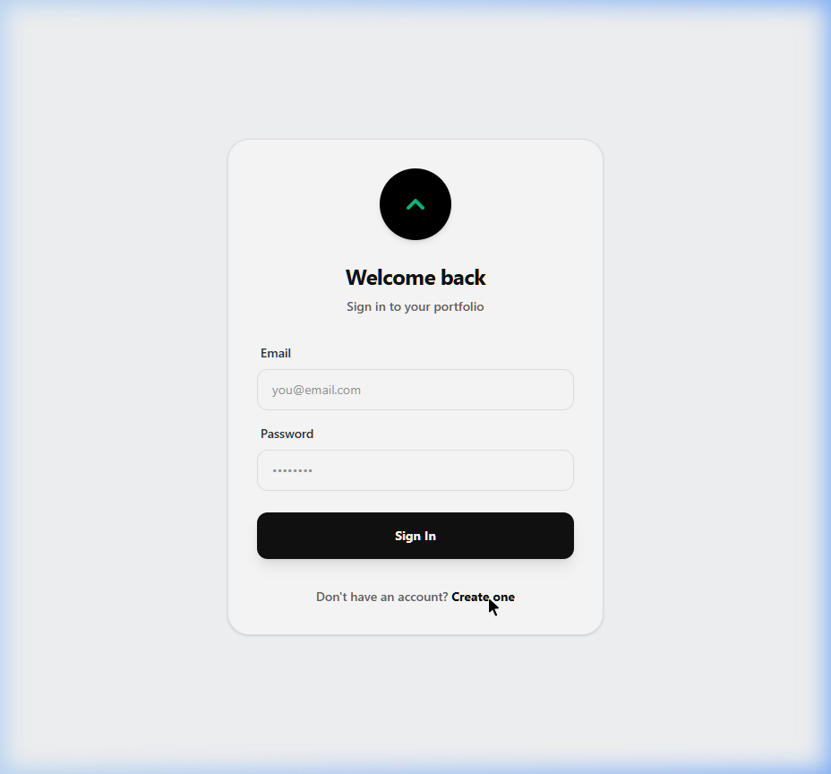
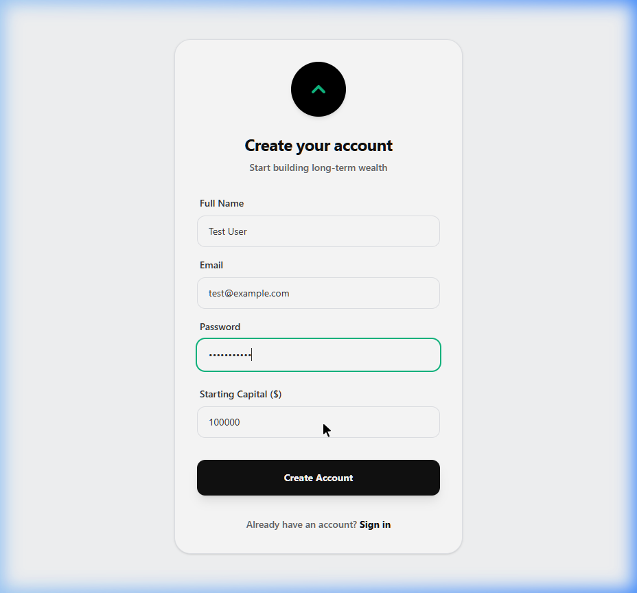
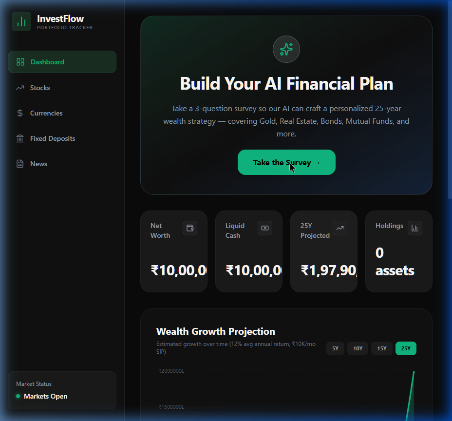
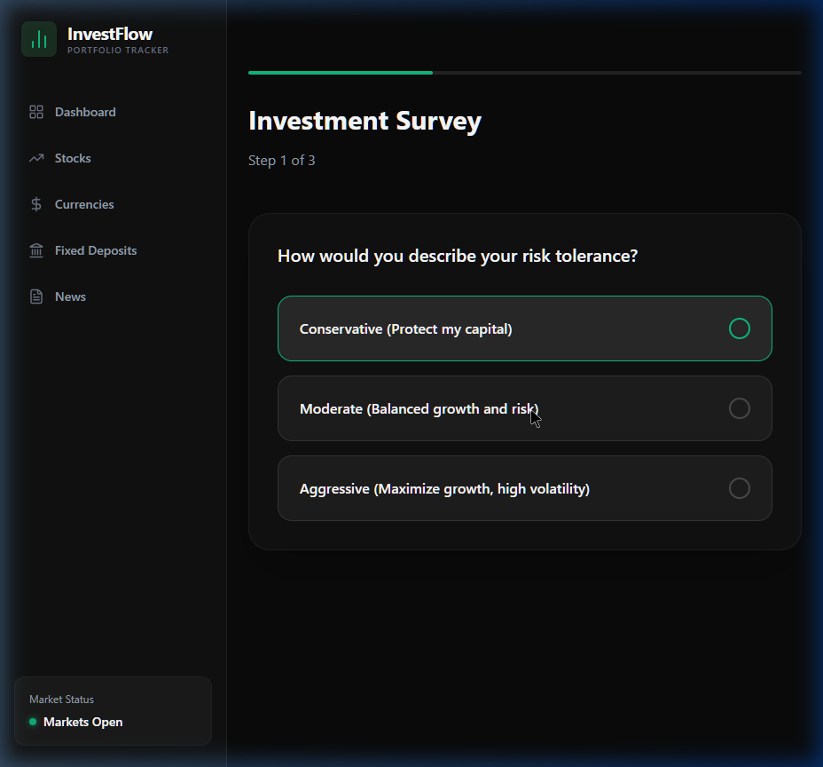
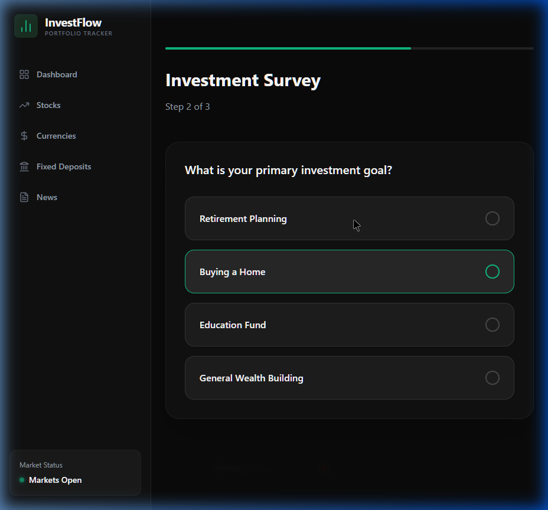
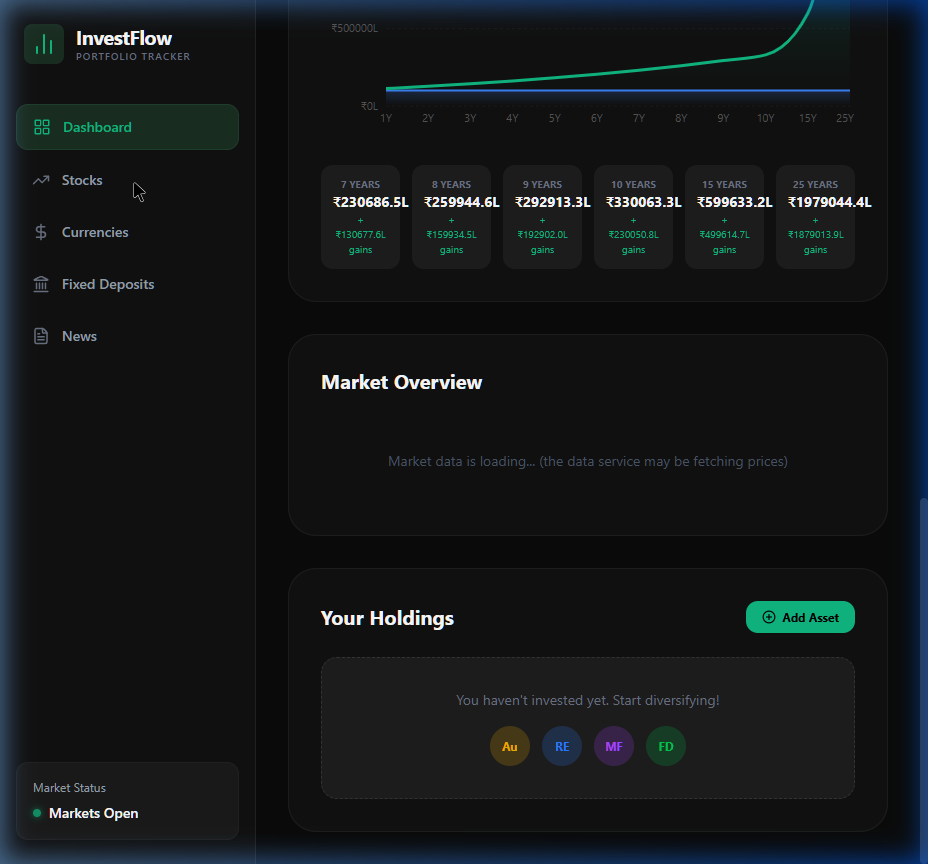
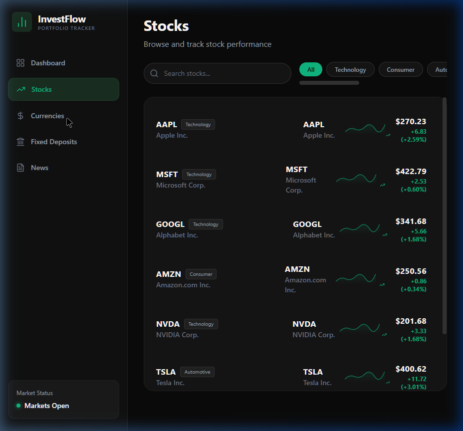
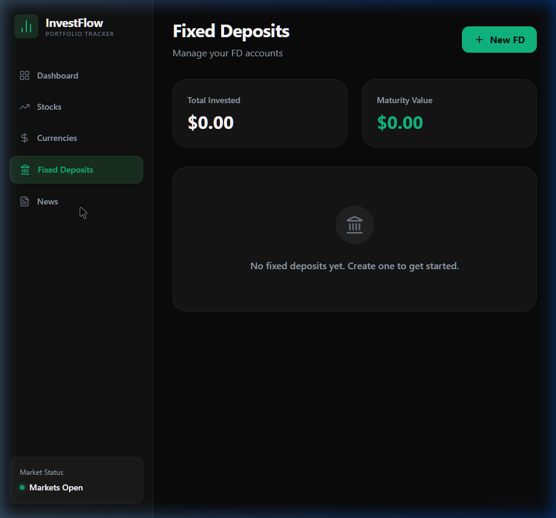

# InvestFlow — Wealth Management Platform

A full-stack wealth management application built for long-term investors. It tracks diverse asset classes — gold, real estate, bonds, mutual funds, fixed deposits, and stocks — and uses AI to generate personalized financial plans based on each user's risk profile and goals.

---

## Table of Contents

- [Overview](#overview)
- [Key Features](#key-features)
- [Screenshots](#screenshots)
- [Architecture](#architecture)
- [Tech Stack](#tech-stack)
- [Getting Started](#getting-started)
- [Tutorial](#tutorial)
- [API Reference](#api-reference)
- [Project Structure](#project-structure)
- [Data Sources](#data-sources)
- [Configuration](#configuration)
- [Future Roadmap](#future-roadmap)
- [Contributing](#contributing)
- [License](#license)

---

## Overview

Most investment platforms focus almost entirely on short-term stock trading. InvestFlow takes a different approach — it is built around **long-term wealth building**. The dashboard tracks growth projections over 1 to 25 years, factors in systematic monthly investments (SIPs), and covers asset classes that matter for serious wealth accumulation: gold, real estate, bonds, mutual funds, and fixed deposits alongside traditional equities.

When a new user signs up, they take a short 3-question survey. The responses are sent to Google's Gemini AI, which analyzes the investor's risk tolerance, financial goals, and time horizon to produce a structured investment plan. This plan — complete with asset allocation percentages and period-specific advice — appears directly on the dashboard alongside interactive growth charts.

The app runs entirely on your local machine with no external database server required. SQLite handles all data storage, and Yahoo Finance provides real-time market data for 30+ financial instruments across US and Indian markets.

---

## Key Features

**Authentication**
- Passwords are hashed with bcrypt (no plaintext storage)
- Sessions are managed with JWT tokens (24-hour expiry)
- Simple email/password flow — no external services required

**AI Financial Planning**
- 3-question investor survey (risk tolerance, goals, time horizon)
- Google Gemini AI generates a personalized 25-year wealth strategy
- Asset allocation recommendations across gold, real estate, bonds, mutual funds, etc.
- Period-specific advice broken into 1-5 year, 5-10 year, and 10-25 year segments

**Wealth Growth Projections**
- Interactive area charts showing projected wealth over 1, 2, 3, 4, 5, 6, 7, 8, 9, 10, 15, and 25 years
- Two overlaid lines: total amount invested vs total value (so you can see the compound gains)
- Configurable starting capital, monthly SIP amount, and expected annual return rate
- Calculation engine available in both Python and Go

**Market Data Coverage**
- 30+ instruments tracked in real-time via Yahoo Finance, including:
  - US Indices: S&P 500, Dow Jones, NASDAQ
  - Indian Indices: Nifty 50, BSE Sensex
  - US Stocks: Apple, Microsoft, Google, Amazon, NVIDIA, Tesla
  - Indian Stocks: Reliance, HDFC Bank, TCS, Infosys, ICICI Bank, SBI
  - Precious Metals: Gold and Silver Futures
  - Commodities: Copper, Crude Oil (WTI)
  - Bonds: US 10Y Treasury, US 30Y Treasury, 13W T-Bill
  - Mutual Funds: SBI Bluechip Fund, HDFC Flexi Cap Fund
  - Real Estate: Vanguard REIT ETF, Embassy REIT India
  - Fixed Deposits: iShares Short Treasury Bond ETF
- Data syncs automatically every 30 minutes
- API supports filtering by category and region

**Portfolio Management**
- Buy and sell any tracked asset
- Holdings categorized by type (STOCK, GOLD, REAL_ESTATE, BOND, MUTUAL_FUND, FD)
- Watchlist support
- Full transaction history

---

## Screenshots

### Login Page
Standard email and password authentication. No external dependencies.



### Sign Up
Users provide their name, email, password, and starting investment capital.



### Dashboard — First Visit
New users see a prompt to take the AI investor survey before their plan is generated.



### Investor Survey — Risk Assessment
The first of three questions. Users select their comfort level with investment risk.



### Investor Survey — Goal Selection
Users choose what they are investing for — retirement, buying a home, education, or general wealth building.



### Stocks Page
Browse live stock data with real-time prices and daily change percentages.



### Currencies Page
Track global currency exchange rates.



### News Page
Financial news headlines to stay informed about market movements.



---

## Architecture

```
+------------------+     +-------------------+     +------------------+
|  React + Vite    |---->|  Node.js + Express|---->|  SQLite DB       |
|  Frontend        |     |  Backend (5001)   |     |  investflow.db   |
|  (Port 5173)     |     +---------+---------+     +------------------+
+------------------+               |
                                   | Gemini AI API
                                   v
                          +-----------------+
                          |  Google Gemini   |
                          |  LLM Service    |
                          +-----------------+

+------------------+     +------------------+
|  Python FastAPI  |---->|  Yahoo Finance   |
|  Data Service    |     |  (yfinance)      |
|  (Port 8000)     |     +------------------+
+------------------+

+------------------+
|  Go Engine       |  (Optional: high-performance projections)
|  (Port 8080)     |
+------------------+
```

**How data flows through the system:**
1. The React frontend makes API calls to the Node.js backend and the Python data service
2. The backend handles authentication, portfolio operations, and AI survey analysis via Gemini
3. The Python data service fetches live market data from Yahoo Finance and caches it in the shared SQLite database
4. The Go engine (optional) provides an alternative high-speed calculation endpoint

---

## Tech Stack

| Layer | Technology | Purpose |
|-------|-----------|---------|
| Frontend | React 19, Vite, TailwindCSS | UI, routing, styling |
| Charts | Recharts | Interactive area, pie, and bar charts |
| Icons | Lucide React | Icon system |
| Backend | Node.js, Express 5 | REST API, authentication |
| Auth | bcryptjs, jsonwebtoken | Password hashing, JWT sessions |
| Database | SQLite 3 | Zero-config relational storage |
| AI | Google Gemini 1.5 Flash | Investment plan generation |
| Data | Python, FastAPI, yfinance | Market data ingestion and caching |
| Performance | Go (Golang) | High-speed financial calculations |

---

## Getting Started

### Prerequisites

| Requirement | Version | Check Command |
|-------------|---------|---------------|
| Node.js | 18.x or newer | `node --version` |
| Python | 3.10 or newer | `python --version` |
| npm | 9.x or newer | `npm --version` |
| Go (optional) | 1.21 or newer | `go version` |

### Installation

**1. Clone the repository**
```bash
git clone https://github.com/your-username/investflow.git
cd investflow
```

**2. Install backend dependencies**
```bash
cd backend
npm install
```

**3. Install frontend dependencies**
```bash
cd ../frontend
npm install
```

**4. Install Python dependencies**
```bash
cd ../data-service
python -m pip install fastapi uvicorn yfinance
```

**5. Set up environment variables**

Create a file called `.env` inside the `backend/` directory:

```env
JWT_SECRET=pick_any_random_string_here
GEMINI_API_KEY=your_gemini_api_key_here
PORT=5001
```

To get a Gemini API key, go to [Google AI Studio](https://aistudio.google.com/apikey) and create one for free. The app will still work without it, but the AI survey will return a generic fallback plan instead of a personalized one.

### Running the Application

**Option A: One-click start (Windows)**

Double-click `run_investflow.bat` in the project root. It opens three terminal windows — one for each service.

**Option B: Manual start (any OS)**

Open three separate terminals:

Terminal 1 — Backend:
```bash
cd backend
npm start
```

Terminal 2 — Data Service:
```bash
cd data-service
python main.py
```

Terminal 3 — Frontend:
```bash
cd frontend
npm run dev
```

Once all three are running, open your browser to **http://localhost:5173**.

---

## Tutorial

### Step 1: Create your account

Go to http://localhost:5173. You will see a login page. Click "Create one" at the bottom to switch to the sign-up form. Enter your name, email, a password, and how much starting capital you want to simulate with (for example, 1000000 for ten lakhs). Click "Create Account" and you will be taken straight to your dashboard.

### Step 2: Take the investor survey

On your dashboard, there is a large card at the top that says "Build Your AI Financial Plan." Click the button to start the survey. It asks three questions:

1. **Risk tolerance** — Are you conservative, moderate, or aggressive?
2. **Investment goal** — What are you saving for? (Retirement, a home, education, or general wealth)
3. **Time horizon** — How long do you plan to invest? (1-3 years, 5-10 years, or 15-25 years)

After you answer all three, the AI generates your plan and you are redirected back to the dashboard.

### Step 3: Explore your dashboard

Your dashboard now shows several things:

- Your AI-generated strategy summary with a quote explaining the approach
- An asset allocation pie chart showing recommended percentages for each asset class
- Period-specific advice cards (what to focus on in years 1-5, 5-10, and 10-25)
- Four stat cards: Net Worth, Liquid Cash, 25-Year Projected Value, and number of Holdings
- A wealth growth chart — toggle between 5, 10, 15, and 25 year views. The green line shows total projected value and the blue line shows total invested. The gap between them is your compound gains.
- A gains breakdown grid showing exact numbers for each milestone year
- A full market overview section with live prices grouped by category

### Step 4: Browse market data

Use the sidebar to navigate to the Stocks page. You can search for any ticker symbol. Click on a stock to see its detail page with price history charts (1 week to 1 year ranges) and buy/sell controls.

The dashboard's Market Overview section shows all tracked instruments organized by category — indices, stocks, precious metals, commodities, bonds, mutual funds, real estate, and fixed deposits.

### Step 5: Make an investment

On any stock detail page, enter the number of shares you want to buy and click Buy. Your liquid cash decreases and the holding appears in your portfolio. You can sell later from the same page. All transactions are recorded.

---

## API Reference

### Authentication

| Method | Endpoint | Description |
|--------|----------|-------------|
| POST | `/api/auth/register` | Create a new account |
| POST | `/api/auth/login` | Sign in with email and password |

### Portfolio

| Method | Endpoint | Description |
|--------|----------|-------------|
| GET | `/api/portfolio/:userId` | Get full portfolio (holdings, watchlist, plan) |
| POST | `/api/invest` | Buy or sell an asset |
| POST | `/api/watchlist` | Add or remove from watchlist |

### AI Survey

| Method | Endpoint | Description |
|--------|----------|-------------|
| POST | `/api/survey/analyze` | Submit survey answers, get AI-generated plan |

### Market Data (Python service on port 8000)

| Method | Endpoint | Description |
|--------|----------|-------------|
| GET | `/api/market-data` | All cached market data |
| GET | `/api/market-data?category=GOLD` | Filter by asset category |
| GET | `/api/market-data?region=IN` | Filter by region (US, IN, GLOBAL) |
| GET | `/api/ticker/{symbol}` | Live price for a specific ticker |
| GET | `/api/history/{symbol}?range=1Y` | Historical price data |
| GET | `/api/growth-projection` | Calculate wealth growth projections |

---

## Project Structure

```
investflow/
├── backend/                    
│   ├── index.js               # Main server — auth, portfolio, survey endpoints
│   ├── db.js                  # SQLite database setup and query wrapper
│   ├── services/
│   │   └── llmService.js      # Google Gemini AI integration
│   ├── investflow.db          # Database file (auto-created on first run)
│   ├── .env                   # Environment variables
│   └── package.json
│
├── frontend/                   
│   ├── src/
│   │   ├── pages/
│   │   │   ├── Login.jsx      # Authentication page
│   │   │   ├── Dashboard.jsx  # Main wealth dashboard with charts
│   │   │   ├── Survey.jsx     # AI investor survey (3 questions)
│   │   │   ├── Stocks.jsx     # Stock market browser
│   │   │   ├── StockDetail.jsx# Individual stock view with buy/sell
│   │   │   ├── Currencies.jsx # Currency exchange rates
│   │   │   ├── FixedDeposits.jsx
│   │   │   └── News.jsx       # Financial news feed
│   │   ├── components/
│   │   │   ├── Sidebar.jsx    # Navigation sidebar
│   │   │   ├── StatCard.jsx   # Dashboard metric cards
│   │   │   └── StockRow.jsx   # Stock list row component
│   │   ├── context/
│   │   │   └── AuthContext.jsx # Authentication state management
│   │   └── App.jsx            # Route definitions and layout
│   └── package.json
│
├── data-service/               
│   └── main.py                # FastAPI server — yfinance data + SQLite caching
│
├── calc-engine/                
│   └── main.go                # Go-based financial projection calculator
│
├── docs/screenshots/          # Screenshots used in this README
├── run_investflow.bat         # Windows one-click launcher
├── system_architecture.md     # Detailed architecture documentation
└── README.md
```

---

## Data Sources

| Source | What It Provides | Update Frequency |
|--------|-----------------|-----------------|
| Yahoo Finance (via yfinance) | Stock prices, indices, commodities, bonds, ETFs | Every 30 minutes |
| Google Gemini | AI-generated investment plans | On demand (when user takes survey) |

---

## Configuration

### Environment Variables

| Variable | Required | Description |
|----------|----------|-------------|
| `JWT_SECRET` | Yes | Secret key for signing authentication tokens |
| `GEMINI_API_KEY` | Recommended | Google Gemini API key for AI plan generation |
| `PORT` | No | Backend port (defaults to 5001) |

### Service Ports

| Service | Default Port |
|---------|-------------|
| Frontend (Vite) | 5173 |
| Backend (Express) | 5001 |
| Data Service (FastAPI) | 8000 |
| Go Engine | 8080 |

---

## Future Roadmap

- Real-time WebSocket price streaming
- Portfolio analytics with sector diversification and risk scoring
- Capital gains tax calculator for Indian investors
- Automated SIP scheduling
- PDF portfolio report export
- Multi-currency support (INR, USD, EUR)
- Candlestick charts and technical indicators
- Mobile-responsive progressive web app

---

## Contributing

1. Fork the repository
2. Create a feature branch (`git checkout -b feature/your-feature`)
3. Commit your changes (`git commit -m 'Add your feature'`)
4. Push to the branch (`git push origin feature/your-feature`)
5. Open a Pull Request

---
